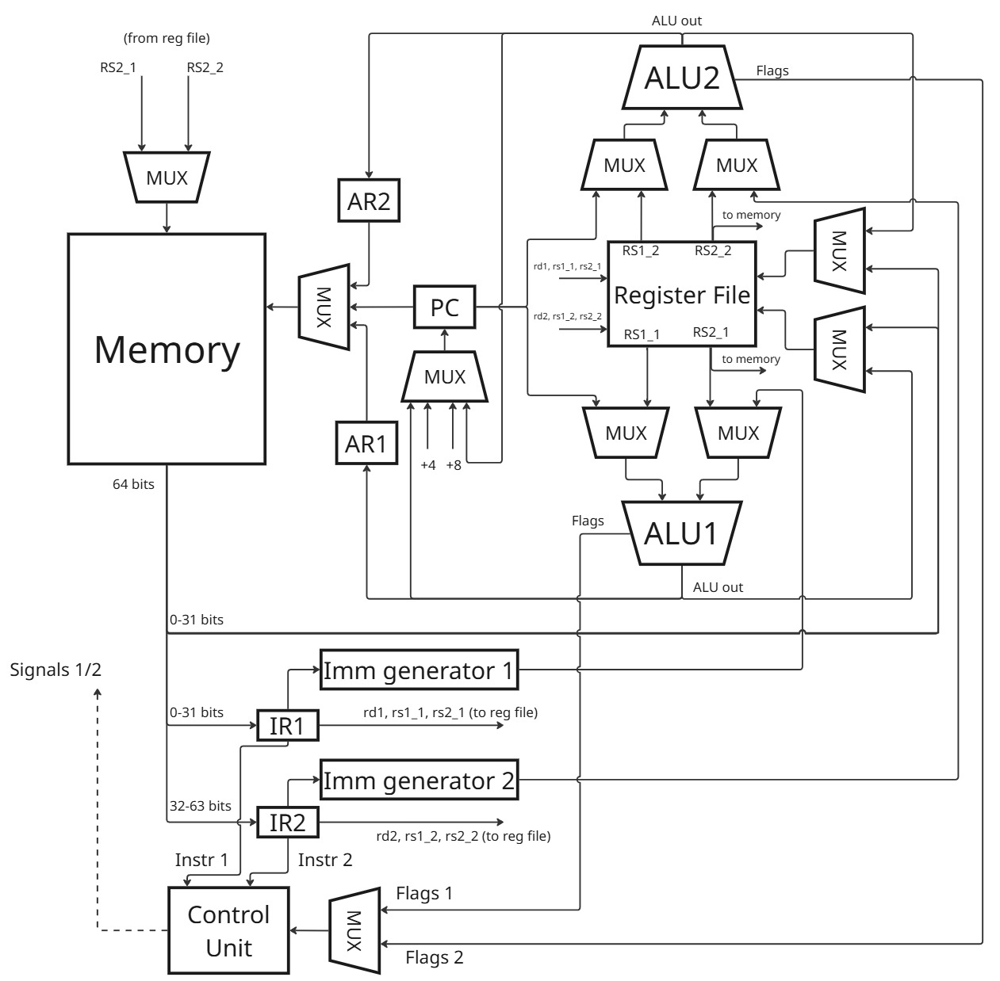
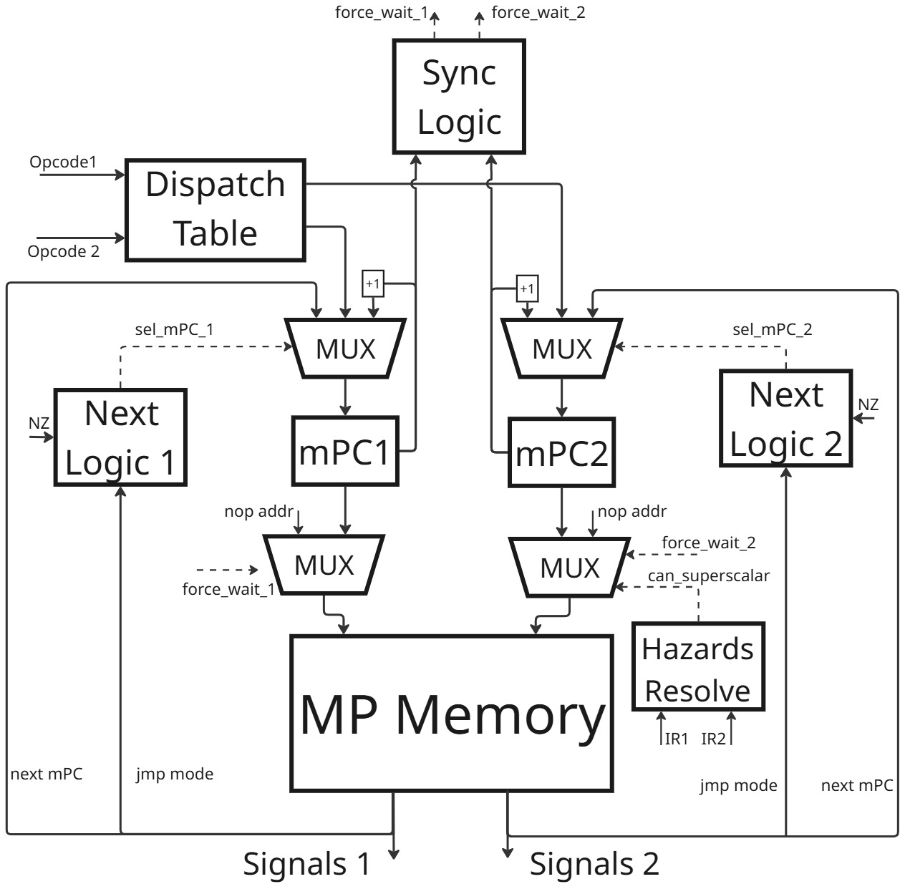

# Forth
Проект состоит из транслятора и эмулятора процессора.

Транслятор `forth` подобного языка программирования в ``risc`` ассемблер.
Эмулятор исполняет ``risc`` ассемблер. 

Проект является адаптацией [лабораторной работы](https://github.com/egor-abramov/AK-lab4/tree/main) по курсу "Архитектура компьютера". Оригинальный проект был переведен с `Python` на ``Golang`` и доработан.

## Язык программирования

``` ebnf
<program> ::= <term> | <term> <program>
<term> ::= <procedure_def> | <var_def> | <import_exp> | <instruction>

<instruction> ::= <math_op>
	            | <logic_op>
	            | <stack_op>
                | <addr_op>
	            | <io_op>
                | <loop_exp>
                | <cond_exp>
                | <number>
                | <string_literal>
                | <identifier>
                | <execution_token>
                | <execute_op>
                | <flag_op>

<instruction_list> ::= <instruction> | <instruction> <instruction_list>

<math_op> ::= "+" | "-" | "*" | "/" | "%" | "cells"

<logic_op> ::= "and" | "not" 	

<stack_op> ::= "dup" | "drop" | "swap"

<addr_op> ::= "!" 		          
	        | "@" 		                  

<io_op> ::= "read" 		        
	      | "." 	    
	      | "emit"    

<loop_exp> ::= "loop" <instruction_list> "endloop" 					                

<flag_op> ::= "=0" | ">0" | "<0"

<cond_exp> ::= "if" <instruction_list> "then" 
	         | "if" <instruction_list> "else" <instruction_list> "then"	  
	         
<string_literal> ::= '"' .* '"'

<identifier> ::= [a-zA-Z0-9_]+

<var_def> ::= "var" <identifier> 
            | "array" <identifier>
            | "string" <string_literal> <identifier>

<contract> ::= "(" \d+ "->" \d+ ")"

<procedure_def> ::= ":" <identifier> <contract> <instruction_list> ";"

<execution_token> ::= "'" <identifier>

<execute_op> ::= "execute"

<import_exp> ::= "import" [A-Za-z0-9_]+
```

**Операции**:

- `+` - сложить два верхних значения на стеке, результат - на вершину стека
- `-` - вычесть из второго значения на стеке верхнее, результат - на вершину стека
- `*` - перемножить два верхних значения на стеке, результат - на вершину стека
- `/` - поделить нацело, результат - на вершину стека
- `%` - остаток от деления, результат - на вершину стека
- `and` - выполнить побитовое «И» для двух верхних значений на стеке
- `not` - выполнить логическое отрицание верхнего значения на стеке
- `dup` - продублировать верхнее значение на стеке
- `drop` - удалить верхнее значение со стека
- `swap` - поменять местами два верхних значения на стеке
- `!` - сохранить значение со стека по адресу, равному второму элементу в стеке
- `@` - загрузить на стек значение по адресу со стека.
- `var <name>` - выделить машинное слово под переменную `<name>`
- `array <name>` - создать массив, количество слов в котором равно числу на стеке
- `string "..." <name>"` - сохранить строку в память и связать ее адрес с `<name>`
- `read` - ввести числовое значение из потока ввода и положить на стек
- `.` - напечатать числовое значение со стека
- `loop ... endloop` - начать выполнение цикла, тело которого ограничено `endloop`. Цикл заканчивается, если после
  выполнения тела цикла на стеке лежит 0.
- `if ... else ... then` - выполнить интсрукциии после `if` если, на стеке единица, иначе выполнить интсрукции после
  `else`. Часть с `else` опциональна.
- `=0` - если значение на стеке равно 0, то положить на стек 1
- `>0` - если значение на стеке больше 0, то положить на стек 1
- `<0` - если значение на стеке меньше 0, то положить на стек 1
- `' <name>` - положить на стек Execution Token слова
- `execute` - взять Execution Token со стека и перейти к выполнению кода по этому адресу
- `<name>` - положить на стек адрес переменной `<name>`
- `cells` - умножить значение на стеке на 4.
- `import <lib>` - импорт библиотеки

Команды выполняются последовательно.
Видимость данных - глобальная.

На уровне стека все данные рассматриваются как числа. Одно и то же значение может быть интерпретироваться как число или
как ASCII-символ, в зависимости от интсрукции.
Поддерживаются числовые литералы (`var`), и константные строки (`string`)

### Контракты
Каждая процедура обязана декларировать стековый контракт. Контракты обеспечивают безопасность работы со стеком, предотвращают утечки памяти, stack underflow и т.д.

Синтаксис `(N -> K)`
  * `N` -- количество элементов, которые процедура заберет со стека
  * `K` -- количество элементов, которые процедура вернет на стек

Проверка процедур на соответствие контрактам происходит во время компиляции. 

**Примеры**
```forth
  : square (1 -> 1)
      dup *
  ; 
  
  : or (2 -> 1)
      not swap not and not
  ;    
```

### Библиотеки
Помимо основных команд реализована возможность импорта процедур из внешних файлов. Сейчас реализовано две библиотеки: `io` и `utils`.

**Функции библиотеки io**:
- `emit` - вывод символа в строковый поток
- `cr` - вывод символа переноса строки
- `print_str` - вывод строковой переменной со стека в строковый поток
- `read_str` - ввод строки с потока ввода по адресу со стека
- `read_num` - ввод числа на стек
- `read_array` - чтение масиива, по адресу со стека
- `print_array` - вывод массива, со стека

**Функции библиотеки utils**:
- `or` - битовое "ИЛИ"

## Организация памяти

Память представляет собой единое адресное пространство из 16384 ячеек. Машинное слово - 32 бита.

Memory-mapped I/O

#### Варианты адресации

- Непосредственная загрузка
- Абсолютная
- Косвенная
- Регистровая

#### Доступные регистры

- `SP` - указатель на стек данных
- `RP` - Указатель на стек возвратов
- `Zero` - всегда хранит 0
- `X0-X4` - регистры для долговременного хранения
- `A0-A2` - регистры для передачи аргументов / возврата значений из функции
- `T0-T4` - регистры для промежуточных операций

#### Разделение памяти

| Ячейки       | Назначение             |
|--------------|------------------------|
| 0x0 - 0x3EF4 | Основная память        | 
| 0x3EF8       | Поток ввода            | 
| 0x3EFC       | Числовой поток вывода  | 
| 0x3F00       | Строковый поток вывода | 

При помощи указателей `SP` и `RP` возможна реализация стеков данных и возврата

Статические данные размещаются в основной памяти сразу после завершения сегмента исполняемого кода (после `HALT`).
Строки храняться в формате *Pascal-строк*. Каждый элемент строки занимает машинное слово *целиком* (4 байта). Символы
хранятся последовательно.

## Система команд

#### Кодирование инструкций:

* Инструкции имеют фиксированный размер в 4 байта.
* Первые 5 бит инструкции - код операции.
* Регистры кодируются 4 битами.

#### Макросы

* `%hi(val)`
    * Выделяет старшие 20 бит числа
* `%lo(val)`
    * Выделяет младшие 12 бит числа

#### Набор инструкций

* Load Upper Immediate
    * ``lui <rd>, <k>``
    * 2 такта
    * Выделяет младшие 20 бит `k`, сдвигает на 12 бит влево и загружает в регистр `rd`
    * Операция: `rd <- (k & 0x000FFFFF) << 12`
* Move
    * `mv <rd>, <rs>`
    * 2 такта
    * Перемещает значение из регистра `rs` в регистр `rd`
    * Операция: `rd <- rs`
* Store
    * `sw <rs2>, <offset>(<rs1>)`
    * 3 такта
    * Сохраняет значение из регистра `rs2` по адресу, вычисляемому как сумма значения регистра `rs1` и `offset`
    * Операция: `Mem[rs1 + offset] <- rs2`
* Load
    * `lw <rd>, <offset>(<rs>)`
    * 3 такта
    * Загружает значение в регистр `rd` из адреса, вычисляемого как сумма значения регистра `rs` и `offset`
    * Операция: `rd <- Mem[rs + offset]`
* Add Immediate
    * `addi <rd>, <rs>, <k>`
    * 2 такта
    * Прибавляет к значению в регистре `rs` младшие 12 бит `k`, рвсширяя знак `k`. Результат сохраняется в регистр `rd`
    * Операция: `rd <- rs + signext(k & 0x00000FFF)`
* Add
    * `add <rd>, <rs1>, <rs2>`
    * 2 такта
    * Складывает значения регистров `rs1` и `rs2`. Результат сохраняется в регистр `rd`.
    * Операция: `rd <- rs1 + rs2`
* Substract
    * `sub <rd>, <rs1>, <rs2>`
    * 2 такта
    * Вычитает значение регистра `rs2` из регистра `rs1`. Результат сохраняется в регистр `rd`.
    * Операция: `rd <- rs1 - rs2`
* Multiply
    * `mul <rd>, <rs1>, <rs2>`
    * 2 такта
    * Умножает регистр `rs1` на `rs2`. Результат сохраняется в `rd`
    * Операция `rd <- rs1 * rs2`
* Division
    * `div <rd>, <rs1>, <rs2>`
    * 2 такта
    * Делит регистр `rs1` на `rs2`. Результат сохраняется в `rd`
    * Операция `rd <- rs1 / rs2`
* Mod
    * `mod <rd>, <rs1>, <rs2>`
    * 2 такта
    * Берет остаток от деления регистра `rs1` на `rs2`. Результат сохраняется в `rd`
    * Операция `rd <- rs1 % rs2`
* Bitwise AND
    * `and <rd>, <rs1>, <rs2>`
    * 2 такта
    * Берет побитовое И регистров `rs1`и `rs2`. Результат сохраняется в `rd`.
    * Операция: `rd <- rs1 & rs2`
* Inversion
    * `inv <rd>, <rs>`
    * 2 такта
    * Битовая инверсия регистра `rs`. Результат сохраняется в `rd`
    * Операция `rd <- ~rs`
* Jump
    * `j <k>`
    * 2 такта
    * Переход на адрес `k`
    * Операция: `PC <- k`
* Jump Register
    * `jr <rs>`
    * 2 такта
    * Переход на адрес в регистре `rs`
    * Операция: `PC <- rs`
* Jump If Zero Register
    * `jz <rs>, <k>`
    * 3 такта
    * Переход на адрес `k`, если в регистре `rs` записан ноль
    * Операция: `if rs == 0 then PC <- k `
* Jump If Greater Than Zero
    * `jg <rs>, <k>`
    * 3 такта
    * Переход на адрес `k`, если в регистре `rs` записано значение большее, чем 0
    * Операция: `if rs > 0 then PC <- k `
* Jump If Less Than Zero
    * `jl <rs>, <k>`
    * 3 такта
    * Переход на адрес `k`, если в регистре `rs` записано значение меньшее, чем 0
    * Операция: `if rs < 0 then PC <- k `
* Halt
    * `halt`
    * Остановка

## Транслятор

Интерфейс командной строки: `go run cmd/translator/main.go <source_path> <target_path>`.
Транслятор реализован в [translator](./translator)

Транслятор выполняет прямой перевод `forth` в ассемблер.

**Этапы трансляции**

- Токенизация исходного кода
- Генерация ассемблера
- Разрешение меток и макросов

**Оптимизация**

- Вершина стека хранится в регистре `t0`, второе значение а стеке хранится в регистре `t1`
- Конструкции `<number> <math_op>`, `<identifier> @` и `<identifier> !` воспринимаются транслятором как цельные команды,
  что позволяет сократить количество ассемблерного кода на выходе.

Вместе с пользовательским кодом транслируется код библиотек. В выходном бинарнике код
библиотек будет располагаться перед пользовательским кодом.

## Модель процессора

Интерфейс командной строки: `go run cmd/machine/main.go [-scalar] <source_path> <input_path>`. Флаг `-scalar` является опциональным, при его использовании исполнение будет происходит в параллельном режиме, по исполнение происходит в суперскалярном режиме.

Модель реализована в [machine](./machine).

### Data Path



**Сигналы**

- `write_mem` - запись в память
- `read_mem` - чтение из памяти
- `write_reg` - запись в регистр
- `latch_pc` - защелкнуть `PC`
- `latch_ir1` - защелкнуть `IR1`
- `latch_ir2` - защелкнуть `IR2`
- `latch_ar` - защелкнуть `AR`
- `set_alu_flags` - установить флаги результата АЛУ
- `sel_alu_l` - левый вход АЛУ
    * `PC`
    * `RS1` - левый выход Register File
- `sel_alu_r` - правый вход АЛУ
    * `RS2` - правый выход Register File
    * `Imm` - значение из `sign_extend`
- `alu_op` - операция в АЛУ
    * `PASS_L` - пропустить левый вход
    * `PASS_R` - пропустить правый вход
    * `+`
    * `-`
    * `*`
    * `/`
    * `%`
    * `and`
    * `inv`
- `sel_imm_mode` - выбор формата расширения
    * `IMM16` - расширение 16ти битовой константы
    * `IMM20` - расширение 20ти битовой константы
    * `IMM12` - расширение 12ти битовой константы
    * `IMM_U` - сдвиг на 12 бит влево
- `sel_mem_addr` - выбор источника адреса памяти
    * `PC`
    * `AR`
- `sel_reg_sr` - выбор источника для записи в регистр
    * `Mem`
    * `ALU`
- `sel_next_pc` - выбор следующего значения `PC`
    * `ALU`
    * `INC4`
    * `INC8`
- `sel_mem_sr` - выбор источника для записи в память
    * `RS2_1`
    * `RS2_2`

**Флаги**

- `Zero`
- `Negative`

В `Control Unit` отправляются флаги из АЛУ и инструкции из `IR1` и `IR2`. Флаги состояния выбираются так: если
инструкция из `IR2` работала и изменяла флаги, то в Control Unit будут переданы флаги из АЛУ2, иначе из АЛУ1.
Из регистров `IR1` и `IR2` в Register File приходят 5ти битовые шины: `rd_1`, `rs1_1`, `rs2_1`, `rd2`, `rs1_2`, `rs2_2`,
в которых закодированы номера регистров для чтения и записи.

### Control Unit



Микропрограммное управление. Суперскаяляр.

**Структура микроинструкции**

- Signals
    * `write_mem` -- бит 27
    * `read_mem` -- бит 26
    * `write_reg` -- бит 25
    * `latch_pc` -- бит 24
    * `latch_ir1` -- бит 23
    * `latch_ir2` -- бит 22
    * `latch_ar` -- бит 21
    * `set_alu_flags` -- бит 20
    * `sel_alu_l` -- бит 19
    * `sel_alu_r` -- бит 18
    * `alu_op` -- биты 17-14
    * `sel_imm_mode` -- биты 13-12
    * `sel_mem_addr` -- бит 11
    * `sel_reg_sr` -- бит 10
    * `sel_next_pc` -- бит 9-8
- Jump Type -- биты 7-5
    * `INC` -- инкремент `mPC`
    * `MAP` -- переход по `dispatch table`
    * `JMP` -- безусловный переход
    * `JMP_Z` -- переход если `zero == 1`
    * `JMP_G` -- переход если `negative == 0 ^ zero == 0`
    * `JMP_L` -- переход если `negative == 1 ^ zero == 0`
- New Addr -- биты 4-0

Сигнал состоит из управляющих сигналов Data Path, Jump Type - стратегия выбора следующего `mPC`, New Addr - новый адрес
`mPC`.

На каждом такте из Data Path приходят по две инструкции (данные из регистров `IR1`, `IR2`) и флаги состояни.

**Компоненты Control Unit**

- `mPC 1/2` - счетчики микрокоманд
- `MUX mPC 1/2` - мультиплексор, выбирабщий следующее значение `mPC`. Новым значением может быть инкремент, 0, результат
  `Dispatch Table` или `New mPC` из микроинструкции
- `Dispatch Table` - принимает опкод из Data Path и на выходе выдает адрес начала микропрограммы для этого опкода.
- `Next Logic 1/2` принимает тип перехода и флаги состояния `NZ` из Data Path. На их основе формируется сигнал
  `sel_mpc`. В случае если микроинструкция требует перехода и условие перехода выполнено, то через мультиплексор пройдет
  значение с шины `New Addr`, если Jump Type равен `Map`, то пройдет значение из `Dispatch Table`, иначе произойдет
  инкремент `mPC`.
- `Hazards Resolve` - принимает `IR1` и `IR2`. Проводит проверку на возможность параллельного запуска инструкций. В случае
  если это не возможно на мультиплексор `mPC2` подается управляющий сигнал, принудительно устанавливающий `mPC2` в
  значение 0 (Fetch).
- `Sync Logic` - принимает `mPC1` и `mPC2`. Если выполнение одной из инструкций завершилось (`mPC` установлен в 0), а
  другой еще нет, то на ссответствующий мультиплексор подается сигнал `force_wait`, устанавливающий значение `mPC` на
  адрес инструкции-пустышки.
- `MP Memory` - память микрокоманд. Имеет два входа для адресов и два выхода для микроинструкций. НА каждом такте выдает
  две микроинструкции, каждая их которых делится на Signals (идет в Data Path), Jmp Type (идет в Next Logic) и Next
  mPC (идет в MUX mPC).

## Суперскаляр

Возможность одновременного исполнения двух инструкций достигается засчет дублирования некоторых элементов схемы: АЛУ,
`IR`, `AR`, `mPC`, выходы и входы Register File. Разрешение конфликтов происходит в схеме `Hazards Resolve` в
`Control Unit`.

**Не разрешается** одновременное исполнение в следующих случаях

- Обе инструкции взаимодействуют с памятью (`lw`, `sw`)
- Первая инструкция - переход (`j`, `jr` и т.д.)
- Инструкция пишет в регистр, из которого читает вторая инструкция
- Инструкции пишут в один регистр
- Первая инструкция `sw` и вторая пишет в регистр, из которого `sw` будет сохранять данные в память.

Инструкции могут исполняться за разное количество тактов. В таком случае, более быстрая инструкция будет находится в
состоянии ожидания до тех пор, пока не завершится более медленная. Синхронизация происходит в схеме `Sync Logic` в
`Control Unit`.

**Сравнение производительности**

| Тест            | Без суперскаляра | Суперскаляр | Разница |
|-----------------|------------------|-------------|---------|
| hello           | 2222             | 1678        | 24%     |
| hello_user_name | 7190             | 5428        | 24%     |
| cat             | 428              | 320         | 25%     |  
| sort            | 7461             | 5559        | 25%     |
| prob1           | 8506233          | 6339851     | 25%     |
| apply_twice     | 513              | 373         | 27%     |
| math            | 340              | 258         | 24%     |
| long_math       | 31358            | 23616       | 24%     |

Суперскаляр дал существенный рост производительности - в среднем программы стали делать на 25% тиков меньше

## Тестирование

Тестирование выполняется при помощи golden тестов. Тесты реализованы в [main_test](./main_test.go).

Конфигурации тестов реализованы в [golden](./golden)

**Список тестов**

- `hello` - вывод `"Hello World!"`
- `hello_user_name` - чтение имени и вывод приветствия
- `math` - базовая математика, процедуры, использование `execution token`
- `cat` - вывод символов из потока ввода
- `long_math` - пример арифметики двойной точности
- `sort` - сортировака массива из потока ввода
- `prob1` - поиск наибольшего палиндрома, являющегося произведением двух трехзначных чисел

Запуск тестов: ```go test -v```

Обновление конфигурации тестов: ```go test -v -update```

### Пример использования

**Трансляция**

```shell
$ go run cmd/translator/main.go hello.fth hello.bin
2026/07/07 23:58:04 Translated hello.fth to hello.bin
$ cat hello.bin.hex
<label>                   | <address>  | <HEXCODE>  | <mnemonic>
                          | 2988       | 0x06       | ADDI SP, SP, -4
                          | 2992       | 0x01       | SW T1, 0(SP)
                          | 2996       | 0x04       | MV T1, T0
                          | 3000       | 0x02       | LUI T0, %hi(STRING_HELLO)
                          | 3004       | 0x06       | ADDI T0, T0, %lo(STRING_HELLO)
                          | 3008       | 0x02       | LUI T2, %hi(_RET_3028)
                          | 3012       | 0x06       | ADDI T2, T2, %lo(_RET_3028)
                          | 3016       | 0x06       | ADDI RP, RP, -4
                          | 3020       | 0x01       | SW T2, 0(RP)
                          | 3024       | 0x0B       | J PRINT_STR
                          | 3028       | 0x0D       | HALT
STRING_HELLO              | 3088       | 0x0000000C | DATA
                          | 3092       | 0x00000048 | DATA
                          | 3096       | 0x00000065 | DATA
                          | 3100       | 0x0000006C | DATA
                          | 3104       | 0x0000006C | DATA
                          | 3108       | 0x0000006F | DATA
                          | 3112       | 0x00000020 | DATA
                          | 3116       | 0x00000057 | DATA
                          | 3120       | 0x0000006F | DATA
                          | 3124       | 0x00000072 | DATA
                          | 3128       | 0x0000006C | DATA
                          | 3132       | 0x00000064 | DATA
                          | 3136       | 0x00000021 | DATA
```

**Модель процессора**

```shell
$ go run cmd/machine/main.go hello.bin hello.txt
2026/07/08 00:03:01 Ticks executed: 1675
2026/07/08 00:03:01 Output:
2026/07/08 00:03:01 Hello World!

2026/07/08 00:03:01 Trace:
2026/07/08 00:03:01 Tick: 0001 | PC: 0x0000   | m1: 1 m2: 0  |   LUI |  IDLE | Z:0 N:0
2026/07/08 00:03:01 Tick: 0002 | PC: 0x0004   | m1: 0 m2: 0  | FETCH | FETCH | Z:0 N:0
2026/07/08 00:03:01 Tick: 0003 | PC: 0x0004   | m1: 7 m2: 1  |  ADDI |   LUI | Z:0 N:0
2026/07/08 00:03:01 Tick: 0004 | PC: 0x000C   | m1: 0 m2: 0  | FETCH | FETCH | Z:0 N:0
2026/07/08 00:03:01 Tick: 0005 | PC: 0x000C   | m1: 7 m2: 0  |  ADDI |  IDLE | Z:0 N:0
2026/07/08 00:03:01 Tick: 0006 | PC: 0x0010   | m1: 0 m2: 0  | FETCH | FETCH | Z:0 N:0
2026/07/08 00:03:01 Tick: 0007 | PC: 0x0010   | m1: 15 m2: 0 |     J |  IDLE | Z:0 N:0
2026/07/08 00:03:01 Tick: 0008 | PC: 0x0044   | m1: 0 m2: 0  | FETCH | FETCH | Z:0 N:0
2026/07/08 00:03:01 Tick: 0009 | PC: 0x0044   | m1: 15 m2: 0 |     J |  IDLE | Z:0 N:0
2026/07/08 00:03:01 Tick: 0010 | PC: 0x0078   | m1: 0 m2: 0  | FETCH | FETCH | Z:0 N:0
2026/07/08 00:03:01 Tick: 0011 | PC: 0x0078   | m1: 15 m2: 0 |     J |  IDLE | Z:0 N:0
2026/07/08 00:03:01 Tick: 0012 | PC: 0x00EC   | m1: 0 m2: 0  | FETCH | FETCH | Z:0 N:0
2026/07/08 00:03:01 Tick: 0013 | PC: 0x00EC   | m1: 15 m2: 0 |     J |  IDLE | Z:0 N:0
2026/07/08 00:03:01 Tick: 0014 | PC: 0x0174   | m1: 0 m2: 0  | FETCH | FETCH | Z:0 N:0
2026/07/08 00:03:01 Tick: 0015 | PC: 0x0174   | m1: 15 m2: 0 |     J |  IDLE | Z:0 N:0
2026/07/08 00:03:01 Tick: 0016 | PC: 0x0224   | m1: 0 m2: 0  | FETCH | FETCH | Z:0 N:0
2026/07/08 00:03:01 Tick: 0017 | PC: 0x0224   | m1: 15 m2: 0 |     J |  IDLE | Z:0 N:0
2026/07/08 00:03:01 Tick: 0018 | PC: 0x02D0   | m1: 0 m2: 0  | FETCH | FETCH | Z:0 N:0
2026/07/08 00:03:01 Tick: 0019 | PC: 0x02D0   | m1: 15 m2: 0 |     J |  IDLE | Z:0 N:0
2026/07/08 00:03:01 Tick: 0020 | PC: 0x0444   | m1: 0 m2: 0  | FETCH | FETCH | Z:0 N:0
2026/07/08 00:03:01 Tick: 0021 | PC: 0x0444   | m1: 15 m2: 0 |     J |  IDLE | Z:0 N:0
2026/07/08 00:03:01 Tick: 0022 | PC: 0x0870   | m1: 0 m2: 0  | FETCH | FETCH | Z:0 N:0
2026/07/08 00:03:01 Tick: 0023 | PC: 0x0870   | m1: 15 m2: 0 |     J |  IDLE | Z:0 N:0
2026/07/08 00:03:01 Tick: 0024 | PC: 0x09F8   | m1: 0 m2: 0  | FETCH | FETCH | Z:0 N:0
2026/07/08 00:03:01 Tick: 0025 | PC: 0x09F8   | m1: 15 m2: 0 |     J |  IDLE | Z:0 N:0
2026/07/08 00:03:01 Tick: 0026 | PC: 0x0AF0   | m1: 0 m2: 0  | FETCH | FETCH | Z:0 N:0
2026/07/08 00:03:01 Tick: 0027 | PC: 0x0AF0   | m1: 15 m2: 0 |     J |  IDLE | Z:0 N:0
2026/07/08 00:03:01 Tick: 0028 | PC: 0x0BAC   | m1: 0 m2: 0  | FETCH | FETCH | Z:0 N:0
2026/07/08 00:03:01 Tick: 0029 | PC: 0x0BAC   | m1: 7 m2: 0  |  ADDI |  IDLE | Z:0 N:0
2026/07/08 00:03:01 Tick: 0030 | PC: 0x0BB0   | m1: 0 m2: 0  | FETCH | FETCH | Z:0 N:0
2026/07/08 00:03:01 Tick: 0031 | PC: 0x0BB0   | m1: 3 m2: 0  |    SW |  IDLE | Z:0 N:0
2026/07/08 00:03:01 Tick: 0032 | PC: 0x0BB4   | m1: 4 m2: 0  |    SW |  IDLE | Z:0 N:0
2026/07/08 00:03:01 Tick: 0033 | PC: 0x0BB4   | m1: 0 m2: 0  | FETCH | FETCH | Z:0 N:0
2026/07/08 00:03:01 Tick: 0034 | PC: 0x0BB4   | m1: 2 m2: 1  |    MV |   LUI | Z:0 N:0
2026/07/08 00:03:01 Tick: 0035 | PC: 0x0BBC   | m1: 0 m2: 0  | FETCH | FETCH | Z:1 N:0
2026/07/08 00:03:01 Tick: 0036 | PC: 0x0BBC   | m1: 7 m2: 1  |  ADDI |   LUI | Z:1 N:0
2026/07/08 00:03:01 Tick: 0037 | PC: 0x0BC4   | m1: 0 m2: 0  | FETCH | FETCH | Z:0 N:0
2026/07/08 00:03:01 Tick: 0038 | PC: 0x0BC4   | m1: 7 m2: 7  |  ADDI |  ADDI | Z:0 N:0
2026/07/08 00:03:01 Tick: 0039 | PC: 0x0BCC   | m1: 0 m2: 0  | FETCH | FETCH | Z:0 N:0
2026/07/08 00:03:01 Tick: 0040 | PC: 0x0BCC   | m1: 3 m2: 0  |    SW |  IDLE | Z:0 N:0
2026/07/08 00:03:01 Tick: 0041 | PC: 0x0BD0   | m1: 4 m2: 0  |    SW |  IDLE | Z:0 N:0
2026/07/08 00:03:01 Tick: 0042 | PC: 0x0BD0   | m1: 0 m2: 0  | FETCH | FETCH | Z:0 N:0
2026/07/08 00:03:01 Tick: 0043 | PC: 0x0BD0   | m1: 15 m2: 0 |     J |  IDLE | Z:0 N:0
2026/07/08 00:03:01 Tick: 0044 | PC: 0x0178   | m1: 0 m2: 0  | FETCH | FETCH | Z:0 N:0
2026/07/08 00:03:01 Tick: 0045 | PC: 0x0178   | m1: 1 m2: 0  |   LUI |  IDLE | Z:0 N:0
2026/07/08 00:03:01 Tick: 0046 | PC: 0x017C   | m1: 0 m2: 0  | FETCH | FETCH | Z:0 N:0
2026/07/08 00:03:01 Tick: 0047 | PC: 0x017C   | m1: 7 m2: 0  |  ADDI |  IDLE | Z:0 N:0
2026/07/08 00:03:01 Tick: 0048 | PC: 0x0180   | m1: 0 m2: 0  | FETCH | FETCH | Z:0 N:0
2026/07/08 00:03:01 Tick: 0049 | PC: 0x0180   | m1: 3 m2: 0  |    SW |  IDLE | Z:0 N:0
2026/07/08 00:03:01 Tick: 0050 | PC: 0x0184   | m1: 4 m2: 0  |    SW |  IDLE | Z:0 N:0
2026/07/08 00:03:01 Tick: 0051 | PC: 0x0184   | m1: 0 m2: 0  | FETCH | FETCH | Z:0 N:0
2026/07/08 00:03:01 Tick: 0052 | PC: 0x0184   | m1: 2 m2: 5  |    MV |    LW | Z:0 N:0
2026/07/08 00:03:01 Tick: 0053 | PC: 0x018C   | m1: 0 m2: 6  |  IDLE |    LW | Z:1 N:0
2026/07/08 00:03:01 Tick: 0054 | PC: 0x018C   | m1: 0 m2: 0  | FETCH | FETCH | Z:1 N:0
2026/07/08 00:03:01 Tick: 0055 | PC: 0x018C   | m1: 7 m2: 0  |  ADDI |  IDLE | Z:1 N:0
2026/07/08 00:03:01 Tick: 0056 | PC: 0x0190   | m1: 0 m2: 0  | FETCH | FETCH | Z:0 N:0
2026/07/08 00:03:01 Tick: 0057 | PC: 0x0190   | m1: 7 m2: 0  |  ADDI |  IDLE | Z:0 N:0
2026/07/08 00:03:01 Tick: 0058 | PC: 0x0194   | m1: 0 m2: 0  | FETCH | FETCH | Z:0 N:0
2026/07/08 00:03:01 Tick: 0059 | PC: 0x0194   | m1: 3 m2: 0  |    SW |  IDLE | Z:0 N:0
2026/07/08 00:03:01 Tick: 0060 | PC: 0x0198   | m1: 4 m2: 0  |    SW |  IDLE | Z:0 N:0
2026/07/08 00:03:01 Tick: 0061 | PC: 0x0198   | m1: 0 m2: 0  | FETCH | FETCH | Z:0 N:0
2026/07/08 00:03:01 Tick: 0062 | PC: 0x0198   | m1: 2 m2: 1  |    MV |   LUI | Z:0 N:0
2026/07/08 00:03:01 Tick: 0063 | PC: 0x01A0   | m1: 0 m2: 0  | FETCH | FETCH | Z:1 N:0
2026/07/08 00:03:01 Tick: 0064 | PC: 0x01A0   | m1: 7 m2: 0  |  ADDI |  IDLE | Z:1 N:0
2026/07/08 00:03:01 Tick: 0065 | PC: 0x01A4   | m1: 0 m2: 0  | FETCH | FETCH | Z:0 N:0
2026/07/08 00:03:01 Tick: 0066 | PC: 0x01A4   | m1: 5 m2: 0  |    LW |  IDLE | Z:0 N:0
2026/07/08 00:03:01 Tick: 0067 | PC: 0x01A8   | m1: 6 m2: 0  |    LW |  IDLE | Z:0 N:0
2026/07/08 00:03:01 Tick: 0068 | PC: 0x01A8   | m1: 0 m2: 0  | FETCH | FETCH | Z:0 N:0
2026/07/08 00:03:01 Tick: 0069 | PC: 0x01A8   | m1: 5 m2: 1  |    LW |   LUI | Z:0 N:0
2026/07/08 00:03:01 Tick: 0070 | PC: 0x01B0   | m1: 6 m2: 0  |    LW |  IDLE | Z:0 N:0
2026/07/08 00:03:01 Tick: 0071 | PC: 0x01B0   | m1: 0 m2: 0  | FETCH | FETCH | Z:0 N:0
2026/07/08 00:03:01 Tick: 0072 | PC: 0x01B0   | m1: 7 m2: 0  |  ADDI |  IDLE | Z:0 N:0
2026/07/08 00:03:01 Tick: 0073 | PC: 0x01B4   | m1: 0 m2: 0  | FETCH | FETCH | Z:0 N:0
2026/07/08 00:03:01 Tick: 0074 | PC: 0x01B4   | m1: 3 m2: 0  |    SW |  IDLE | Z:0 N:0
2026/07/08 00:03:01 Tick: 0075 | PC: 0x01B8   | m1: 4 m2: 0  |    SW |  IDLE | Z:0 N:0
2026/07/08 00:03:01 Tick: 0076 | PC: 0x01B8   | m1: 0 m2: 0  | FETCH | FETCH | Z:0 N:0
2026/07/08 00:03:01 Tick: 0077 | PC: 0x01B8   | m1: 2 m2: 5  |    MV |    LW | Z:0 N:0
2026/07/08 00:03:01 Tick: 0078 | PC: 0x01C0   | m1: 0 m2: 6  |  IDLE |    LW | Z:1 N:0
2026/07/08 00:03:01 Tick: 0079 | PC: 0x01C0   | m1: 0 m2: 0  | FETCH | FETCH | Z:1 N:0
2026/07/08 00:03:01 Tick: 0080 | PC: 0x01C0   | m1: 7 m2: 0  |  ADDI |  IDLE | Z:1 N:0
2026/07/08 00:03:01 Tick: 0081 | PC: 0x01C4   | m1: 0 m2: 0  | FETCH | FETCH | Z:0 N:0
2026/07/08 00:03:01 Tick: 0082 | PC: 0x01C4   | m1: 7 m2: 0  |  ADDI |  IDLE | Z:0 N:0
2026/07/08 00:03:01 Tick: 0083 | PC: 0x01C8   | m1: 0 m2: 0  | FETCH | FETCH | Z:0 N:0
2026/07/08 00:03:01 Tick: 0084 | PC: 0x01C8   | m1: 3 m2: 0  |    SW |  IDLE | Z:0 N:0
2026/07/08 00:03:01 Tick: 0085 | PC: 0x01CC   | m1: 4 m2: 0  |    SW |  IDLE | Z:0 N:0
2026/07/08 00:03:01 Tick: 0086 | PC: 0x01CC   | m1: 0 m2: 0  | FETCH | FETCH | Z:0 N:0
2026/07/08 00:03:01 Tick: 0087 | PC: 0x01CC   | m1: 2 m2: 1  |    MV |   LUI | Z:0 N:0
2026/07/08 00:03:01 Tick: 0088 | PC: 0x01D4   | m1: 0 m2: 0  | FETCH | FETCH | Z:1 N:0
2026/07/08 00:03:01 Tick: 0089 | PC: 0x01D4   | m1: 7 m2: 0  |  ADDI |  IDLE | Z:1 N:0
2026/07/08 00:03:01 Tick: 0090 | PC: 0x01D8   | m1: 0 m2: 0  | FETCH | FETCH | Z:0 N:0
2026/07/08 00:03:01 Tick: 0091 | PC: 0x01D8   | m1: 5 m2: 0  |    LW |  IDLE | Z:0 N:0
2026/07/08 00:03:01 Tick: 0092 | PC: 0x01DC   | m1: 6 m2: 0  |    LW |  IDLE | Z:0 N:0
2026/07/08 00:03:01 Tick: 0093 | PC: 0x01DC   | m1: 0 m2: 0  | FETCH | FETCH | Z:0 N:0
2026/07/08 00:03:01 Tick: 0094 | PC: 0x01DC   | m1: 2 m2: 7  |    MV |  ADDI | Z:0 N:0
2026/07/08 00:03:01 Tick: 0095 | PC: 0x01E4   | m1: 0 m2: 0  | FETCH | FETCH | Z:1 N:0
2026/07/08 00:03:01 Tick: 0096 | PC: 0x01E4   | m1: 20 m2: 0 |    JG |  IDLE | Z:1 N:0
2026/07/08 00:03:01 Tick: 0097 | PC: 0x01E4   | m1: 19 m2: 0 |    JG |  IDLE | Z:0 N:0
2026/07/08 00:03:01 Tick: 0098 | PC: 0x01EC   | m1: 0 m2: 0  | FETCH | FETCH | Z:0 N:0
2026/07/08 00:03:01 Tick: 0099 | PC: 0x01EC   | m1: 7 m2: 0  |  ADDI |  IDLE | Z:0 N:0
2026/07/08 00:03:01 Tick: 0100 | PC: 0x01F0   | m1: 0 m2: 0  | FETCH | FETCH | Z:0 N:0
```